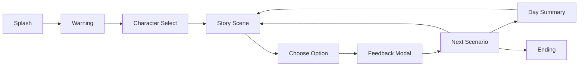

# ReadTheRoom

ReadTheRoom is an Expo-based narrative choice game about reading social situations, making decisions, and managing character stats through short story episodes.

The active application lives in [`ReadTheRoom.App`](ReadTheRoom.App).

## Features

- Mobile-first story game UI built with Expo and React Native.
- Character-based scenario packs with localized Korean and English text.
- Choice-driven progression with stat changes, feedback, tips, summaries, and endings.
- Save/resume support through local AsyncStorage.
- StoryMap roadmap UI for reviewing completed episodes and current progress.
- Release-focused logic tests for scenario loading, transitions, persistence, result cards, stats, and mojibake prevention.

## Tech Stack

- Expo 54
- Expo Router
- React 19
- React Native 0.81
- TypeScript 5.9
- AsyncStorage
- Vitest
- GitHub Actions CI

## Quick Start

```bash
cd ReadTheRoom.App
npm ci
npm start
```

Then open the project in Expo Go or run one of the platform commands:

```bash
npm run android
npm run ios
npm run web
```

## Testing

```bash
cd ReadTheRoom.App
npm test
npm run test:coverage
npm run check:encoding
npm run check:localization
npm run lint
npm run typecheck
```

The current test suite is optimized for release-blocking logic and data validation. Coverage reporting is available through Vitest, while UI integration testing is planned as a later layer.

## Basic Game Flow



## Project Structure

```text
ReadTheRoom/
  README.md
  docs/
  ReadTheRoom.App/
    app/
    components/
    domain/
    features/
    shared/
    utils/
    assets/
    tests/
```

## Documentation

- [Documentation Hub](docs/README.md)
- [Architecture](docs/architecture.md)
- [Game Flow](docs/game-flow.md)
- [Scenario Format](docs/scenario-format.md)
- [Testing Strategy](docs/testing-strategy.md)
- [Encoding Policy](docs/encoding-policy.md)
- [Contributing](docs/contributing.md)
- [Release Checklist](docs/release-checklist.md)
- [Roadmap](docs/roadmap.md)
- [Legacy Backend](docs/legacy-backend.md)

## Legacy Backend

The previous .NET Azure Functions backend is no longer part of the active app. It remains available in Git history under the `archive/server-backend-before-removal-2026-06-10` tag. See [Legacy Backend](docs/legacy-backend.md).
