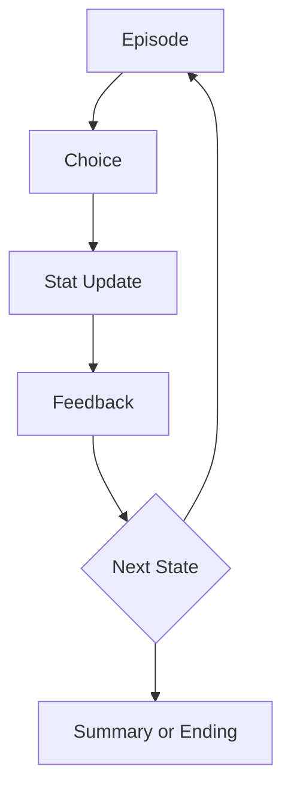
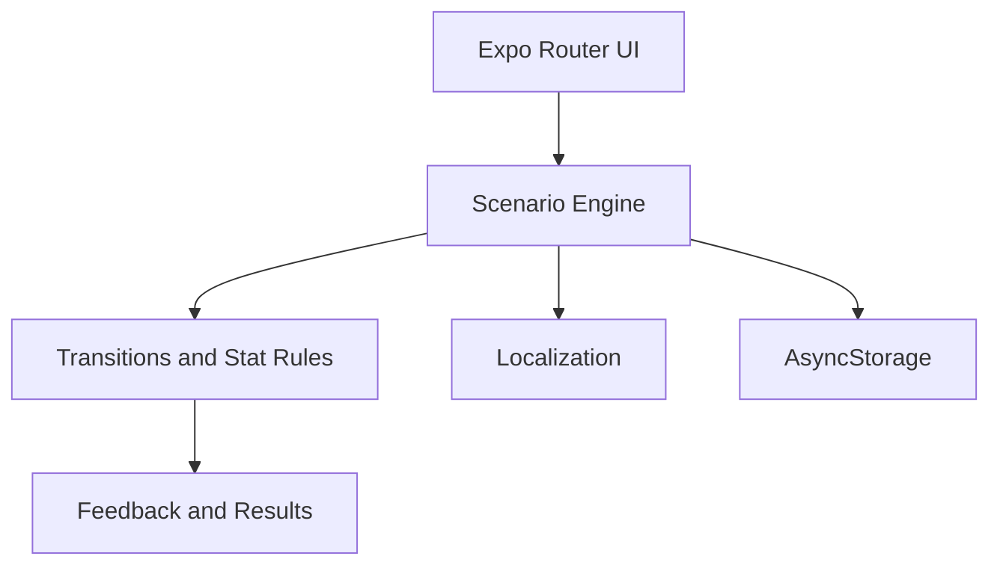

# ReadTheRoom

Mobile-first narrative choice game about reading social situations.

[](https://github.com/kbyunghak/ReadTheRoom/actions/workflows/ci.yml)
[](#current-status)

## Overview

ReadTheRoom is an Expo-based story game in which players interpret social
situations, make choices, and manage character stats across short episodes. The
active application lives in [`ReadTheRoom.App`](ReadTheRoom.App).

**Project Type:** Narrative Mobile Game

## Live Demo

A public Web or app-store demo is not currently available. The application can be
run locally with Expo Go, Android, iOS, or the Expo Web target.

## Problem

Social situations often depend on context, tone, and consequences that are
difficult to practice through static explanations. A conventional quiz also does
not provide the continuity, character investment, or delayed consequences needed
to make those decisions memorable.

## Solution

ReadTheRoom turns social decision-making into localized narrative episodes. Each
choice updates stats, provides feedback, and advances through summaries and endings,
while save data preserves progress between sessions.

## Key Features

- Mobile-first interface built with Expo and React Native.
- Choice-driven episodes with stat changes, feedback, tips, and endings.
- Korean and English scenario and interface localization.
- Character-based scenario packs and StoryMap progression.
- Save and resume support through AsyncStorage.
- Release-focused tests for scenarios, transitions, persistence, stats, and results.
- Automated encoding and localization checks that prevent corrupted Korean text.

## How It Works

### Game Flow



1. The scenario registry loads the active character episode.
2. The player selects a response to the current social situation.
3. Domain rules apply stat changes and evaluate transition conditions.
4. The game shows feedback, tips, or result information.
5. Progress continues to the next episode, a summary, or an ending.

## Architecture



Presentation, domain rules, scenario normalization, localization, and persistence
are separated so release-critical logic can be tested without rendering screens.

## Tech Stack

| Area | Technology |
| --- | --- |
| Application | Expo 54, Expo Router |
| UI | React 19, React Native 0.81 |
| Language | TypeScript 5.9 |
| Persistence | AsyncStorage |
| Localization | Korean and English locale and scenario data |
| Testing | Vitest, coverage-v8, custom data validators |
| Delivery | GitHub Actions |

## Project Structure

```text
ReadTheRoom/
|-- ReadTheRoom.App/
|   |-- app/          Expo Router routes and screen orchestration
|   |-- components/   Shared and screen components
|   |-- domain/       Framework-light game rules
|   |-- features/     Feature-scoped presentation modules
|   |-- shared/       Registries and reusable infrastructure
|   |-- utils/        Scenario, persistence, and result helpers
|   |-- assets/       Runtime scenario data and images
|   `-- tests/        Unit and data-integrity tests
|-- docs/             Architecture, format, testing, and release docs
`-- README.md
```

## Current Status

- Active Expo application and core narrative flow are implemented.
- Ken Day 1 and Day 2 are the current release-stabilization focus.
- JSON scenario files remain the active runtime source.
- Save/resume, localization, StoryMap, feedback, summaries, and endings are present.
- Logic and data validation are automated; screen-level integration testing is planned.
- No public demo or app-store release is available yet.

## Getting Started

Requirements: Node.js 22, npm, and Expo Go or a supported platform toolchain.

```bash
git clone https://github.com/kbyunghak/ReadTheRoom.git
cd ReadTheRoom/ReadTheRoom.App
npm ci
npm start
```

Platform commands:

```bash
npm run android
npm run ios
npm run web
```

## Testing

Run from `ReadTheRoom.App`:

```bash
npm run check:encoding
npm run check:localization
npm run validate:ken-scenario
npm run lint
npm run typecheck
npm test
npm run test:coverage
```

The suite prioritizes release-blocking domain logic and scenario-data validation.
Screen-level React Native integration tests are a planned additional layer.

## CI/CD

For pushes and pull requests targeting `master`, GitHub Actions installs
dependencies, validates encoding and localization, validates the Ken scenario,
runs linting and TypeScript checks, and executes the Vitest suite. Deployment is
not configured.

## Documentation

- [Documentation Hub](docs/README.md)
- [Architecture](docs/architecture.md)
- [Game Flow](docs/game-flow.md)
- [Scenario Format](docs/scenario-format.md)
- [Testing Strategy](docs/testing-strategy.md)
- [Encoding Policy](docs/encoding-policy.md)
- [Contributing](docs/contributing.md)
- [Release Checklist](docs/release-checklist.md)
- [Roadmap](docs/roadmap.md)
- [Legacy Backend](docs/legacy-backend.md)

## Commit Message Convention

ReadTheRoom follows a Conventional Commits-style format:

```text
type: concise English summary
```

Common commit types:

- `feat`: user-facing feature additions.
- `fix`: bug fixes and broken behavior recovery.
- `docs`: documentation-only changes.
- `test`: test coverage, validators, or test infrastructure.
- `ci`: GitHub Actions or CI/CD workflow changes.
- `chore`: maintenance, tooling, or project policy updates.
- `refactor`: code structure changes without behavior changes.
- `data`: scenario JSON, character content, or other game data updates.
- `style`: formatting-only changes that do not affect behavior.

Examples:

```text
data: update Ken Day 3 scenario graph
test: add scenario graph validation
fix: restore corrupted Korean UI copy
docs: update release checklist
ci: add scenario validation to workflow
chore: update CI Node runtime
```

## Legacy Backend

The previous .NET Azure Functions backend is archived in Git history under
`archive/server-backend-before-removal-2026-06-10`.

## Roadmap

- Stabilize and expand the current character episodes.
- Improve StoryMap readability and episode-state hierarchy.
- Add screen-level tests for the highest-risk user flows.
- Split remaining large GameScreen responsibilities.
- Add EAS Build configuration when app-store release becomes a concrete target.

## Limitations

- No public demo or app-store build is currently available.
- UI integration tests are not yet in place.
- Current release content is limited and still being stabilized.
- Recognition of social context is represented by authored scenarios, not AI inference.
- Some legacy or draft documentation still requires cleanup or archival.

## License

Copyright © 2026 Andrew Kim, doing business as JOYgle Studio. All rights reserved.

This repository and its original source code, scenario content, game data,
artwork, branding, documentation, and other original materials may not be
reproduced, modified, distributed, or used commercially without prior written
permission.

Third-party libraries, frameworks, fonts, and other dependencies remain
subject to their respective licenses.
