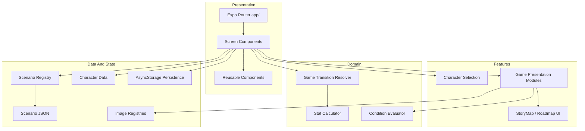

# Architecture

ReadTheRoom is an Expo Router React Native application with a release-first separation between presentation, domain logic, data normalization, and persistence.

For runtime behavior, see [Game Flow](game-flow.md). For data structures, see [Scenario Format](scenario-format.md).

## High-Level Layers



## Directory Responsibilities

```text
ReadTheRoom.App/
  app/                  Expo Router routes and top-level screen orchestration
  components/           Shared visual components and screen components
  domain/               Framework-light domain rules
  features/             Feature-scoped UI modules
  shared/               Shared registries and reusable infrastructure
  utils/                Scenario, display, persistence, and result helpers
  locales/              Character and localized UI copy
  assets/               Runtime data and images
  tests/                Node-based unit and data integrity tests
```

## UI Layer

The app entry flow is coordinated through `app/(tabs)/index.tsx`.

It switches between:

- Splash screen
- Warning screen
- Character selection
- Character detail
- Game screen

The game tab bar is hidden while the story game screen is active so the game can behave like a full-screen narrative canvas.

## Feature Layer

Feature modules contain focused UI and presentation helpers. The current direction is to keep large gameplay UI responsibilities split into smaller modules such as:

- Scenario view
- Choice list
- Result/feedback presentation
- Status card
- StoryMap roadmap

## Domain Layer

Domain logic is kept testable without rendering React Native screens.

Important modules:

- `domain/game/transitions.ts`: resolves choice, summary, failure, ending, and missing-content transitions.
- `domain/stats/types.ts`: defines canonical stat keys and game stat shapes.
- `utils/gameStats.ts`: applies stat changes and checks stat failure thresholds.
- `utils/conditionSummary.ts`: derives the front-side status card condition.
- `utils/resultCard.ts`: derives result card display data from choices.

## Data Layer

Runtime scenario JSON is normalized through `utils/scenarioBundle.ts` and registered by `utils/scenarioRegistry.ts`.

The current runtime path uses JSON scenario files. TypeScript scenario packs exist as migration experiments but are not connected to runtime.

## Save And Resume

Save data is managed by `utils/gamePersistence.ts`.

The save key is scoped by character:

```text
readtheroom_saved_game_v1:{characterId}
```

Saved sessions include:

- Character id
- Language
- Current scenario id
- Current stats
- Play history
- Current situation choices
- Checkpoints
- Updated timestamp

## Localization

Localized text generally uses this shape:

```ts
type LocaleText = {
  ko: string;
  en: string;
};
```

UI and scenario rendering select one language at runtime. Korean should appear in documentation only as intentional game content or localization examples.

## Known Technical Debt

- UI integration tests are not yet in place.
- `npm test` currently uses a long explicit command chain.
- Some legacy or draft documentation still needs cleanup or archival.
- Remaining localization/mojibake cleanup should be tracked separately from documentation work.
