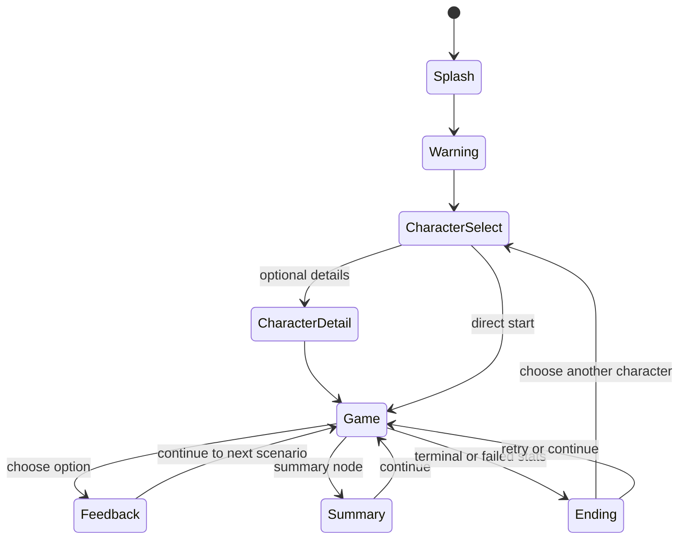
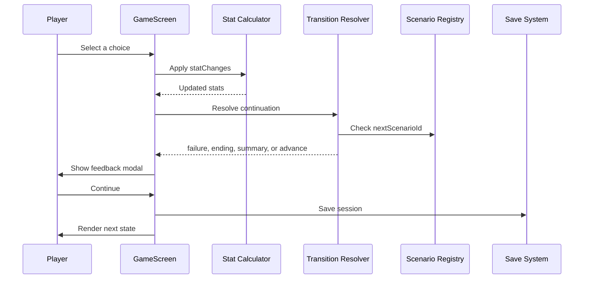
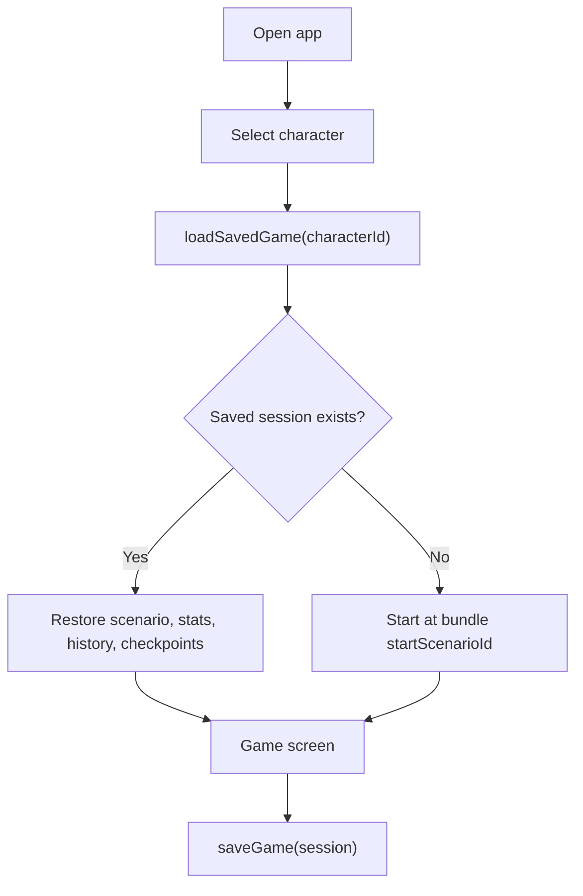

# Game Flow

This document describes the runtime behavior of ReadTheRoom. For data structures, see [Scenario Format](scenario-format.md).

## Player Journey

## Runtime Choice Flow

## Choice Processing

When the player selects a choice:

1. The selected choice is highlighted.
2. Non-selected choices are visually de-emphasized.
3. The choice `statChanges` are applied to the current stats.
4. If any critical stat reaches zero, the failure ending flow takes priority.
5. If the current node is an ending or phase-end node, the transition resolver returns that state.
6. Otherwise, the game advances to `choice.nextScenarioId`.
7. Feedback and optional tips are shown in the feedback modal.

## Summary Flow

`SUMMARY` nodes do not render normal choices. They summarize the current day or phase and use a continue action.

Summary continuation rules:

- If `nextScenarioId` exists and the target node exists, advance to it.
- If `nextScenarioId` exists but the target node is missing, show the in-progress ending fallback.
- If no `nextScenarioId` exists, resolve to an ending state.

## Save And Resume Flow

Save/resume uses AsyncStorage through `utils/gamePersistence.ts`. Saves are character-scoped so one character does not overwrite another character's progress.

## Ending Flow

Endings can be reached by:

- Stat failure after applying choice or summary stat changes.
- A terminal scenario state.
- Missing future content during development.
- Final clear when a full scenario path is available.

Current ending images are registered from event images such as `In_Progress`, `Survived_Ending`, and `Final_Clear`.

## StoryMap Flow

StoryMap displays main roadmap nodes only. A scenario appears in the main roadmap when:

- `type === 'NORMAL'`
- `mainEpisode` is a number

Special events and summaries are excluded from the main grid. Completed roadmap cards can be tapped to return to that checkpoint.
