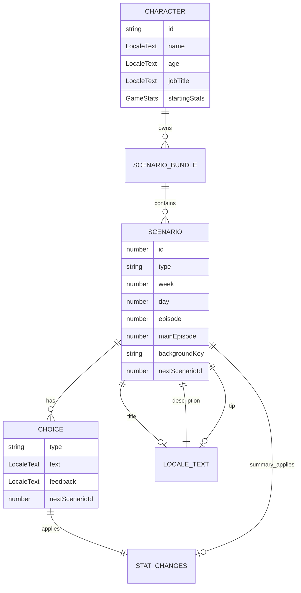

# Scenario Format

This document describes the scenario data format used by the current implementation.

The corrupted draft `docs/schema/TS시나리오_포맷_v1.0.md` is not treated as the official source. This document is based on the current TypeScript types and runtime JSON loader.

For runtime transitions, see [Game Flow](game-flow.md). For test coverage, see [Testing Strategy](testing-strategy.md).

## Current Runtime Source

The active release path loads JSON scenario files through:

```text
ReadTheRoom.App/utils/scenarioRegistry.ts
ReadTheRoom.App/utils/scenarioBundle.ts
```

Character scenario files currently include:

```text
assets/data/scenarios_amy.json
assets/data/scenarios_jina.json
assets/data/scenarios_ken.json
assets/data/scenarios_sora.json
assets/data/scenarios_yoon.json
```

The TypeScript scenario pack under `assets/data/ken/` is not connected to runtime yet.

## Core Relationships



## LocaleText

```ts
type LocaleText = {
  ko: string;
  en: string;
};
```

All user-facing scenario text should include both `ko` and `en`.

## Stats

The canonical stat keys are:

```ts
type GameStats = {
  funds: number;
  mental: number;
  english: number;
  insight: number;
  stamina: number;
  relation: number;
};
```

`StatChanges` uses the same keys in scenario JSON. Runtime helpers normalize missing values where supported, but release scenario files should provide complete stat changes for choices.

## Scenario

The runtime `Scenario` shape is normalized by `utils/scenarioBundle.ts`.

Important fields:

| Field | Required | Notes |
| --- | --- | --- |
| `id` | Yes | Unique scenario id inside the character scenario bundle. |
| `type` | Optional | Common values are `NORMAL` and `SUMMARY`. |
| `week` | Optional | Used by roadmap and progress display. |
| `day` | Optional | Used by header, roadmap, and summaries. |
| `episode` | Optional | Legacy/planning value. |
| `mainEpisode` | Optional | Main roadmap episode number. Special and summary nodes omit this. |
| `title` | Optional | Localized title used by display helpers. |
| `description` | Yes | Localized story text. |
| `tip` | Optional | Localized learning tip. Omit when there is no tip. |
| `backgroundKey` | Optional | Key used by image registries. |
| `choices` | Yes | Normal nodes use choices. Summary nodes may use an empty array. |
| `statChanges` | Optional | Used by summary nodes or other direct stat changes. |
| `nextScenarioId` | Optional | Used by summary and continuation logic. |

## Choice

```ts
type ScenarioChoice = {
  type?: 'GROWTH' | 'STABLE' | 'REALIST';
  text: LocaleText;
  feedback: LocaleText;
  statChanges: GameStats;
  branchTags?: string[];
  nextScenarioId: number;
};
```

Rules:

- Normal nodes should provide three choices.
- Each choice should include localized text and feedback.
- `statChanges` should include all stat keys in release JSON.
- `nextScenarioId` should point to an existing node unless the flow intentionally falls back to an ending state.

## Main Episode Nodes

A node is shown in the StoryMap main grid when:

```ts
scenario.type === 'NORMAL' && typeof scenario.mainEpisode === 'number'
```

Special events are still `NORMAL` nodes, but they omit `mainEpisode`.

## Summary Nodes

Summary nodes use:

```ts
type: 'SUMMARY'
```

Rules:

- They do not render normal choices.
- They use a continue action.
- `choices` may be omitted by some formats or normalized to an empty array.
- `nextScenarioId` may point to the next day or may be absent for an ending flow.

## Supported Input Formats

`createScenarioBundle` currently supports:

1. Legacy object map.
2. V2 phase-based data with `phases`.
3. Flat V2 data with `nodes`.
4. Day bucket data such as `Day1`, `Day2`.

All formats are normalized to:

```ts
type ScenarioBundle = {
  version: string;
  startScenarioId: number;
  scenarios: Record<string, Scenario>;
  phases: ScenarioPhase[];
};
```

## Valid Example

```json
{
  "id": 1,
  "type": "NORMAL",
  "week": 1,
  "day": 1,
  "episode": 1,
  "mainEpisode": 1,
  "title": {
    "ko": "입국 심사",
    "en": "Immigration"
  },
  "backgroundKey": "airport",
  "description": {
    "ko": "입국 심사대 앞에 섰습니다.",
    "en": "You stand before the immigration desk."
  },
  "tip": {
    "ko": "짧고 정확하게 답하면 도움이 됩니다.",
    "en": "Short and accurate answers can help."
  },
  "choices": [
    {
      "type": "GROWTH",
      "text": {
        "ko": "차분하게 목적을 설명한다.",
        "en": "Calmly explain your purpose."
      },
      "feedback": {
        "ko": "차분한 태도가 좋은 인상을 줍니다.",
        "en": "Your calm tone leaves a good impression."
      },
      "statChanges": {
        "funds": 0,
        "mental": 5,
        "english": 10,
        "insight": 5,
        "stamina": -5,
        "relation": 0
      },
      "nextScenarioId": 2
    }
  ]
}
```

## Invalid Examples

Missing localized text:

```json
{
  "description": {
    "ko": "한국어만 있음"
  }
}
```

Missing stat keys:

```json
{
  "statChanges": {
    "mental": 5
  }
}
```

Broken link:

```json
{
  "nextScenarioId": 999999
}
```

Broken links may be allowed only when the product intentionally resolves them to an ending fallback.

## Validation Rules

Release validation should check:

- Scenario ids are unique.
- Object keys match node ids when using legacy object maps.
- Main `NORMAL` nodes have exactly three complete choices.
- Summary nodes do not render regular choices.
- Choice links point to existing nodes unless explicitly handled as fallback.
- Main episode counts match the UI sequence.
- Special and summary nodes do not have `mainEpisode`.
- Localized strings do not contain mojibake patterns.
- `backgroundKey` values map to available image assets.
